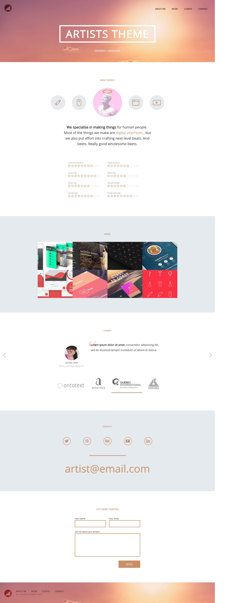

Responsive Website (Jekyll Friendly)
===================

Responsive Website, using Jekyll, following along with DevTips.

Building a Single-Page portfolio site,

<a href="http://www.youtube.com/watch?feature=player_embedded&v=GTBaQ2DcGUk
" target="_blank">
Watch the video on YouTube

</a>
